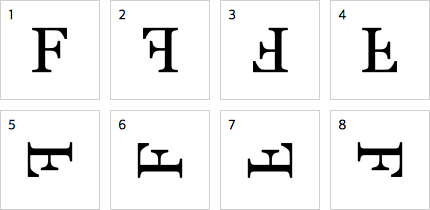

## Assignment 1.1
### Requirements
Environment is ready to use, and test files have been downloaded.
You can activate the shared environment using the following command:

```bash
conda activate assignment
```

<details>
<summary>If you are interested, you can expand here and try installing the environment yourself by following the steps below:</summary>

 Step 1: Install Tesseract-OCR

```bash
  sudo apt-get update -y
  sudo apt-get install tesseract-ocr=4.1.1-2.1build1 -y
  sudo wget https://github.com/tesseract-ocr/tessdata/raw/main/eng.traineddata
  sudo mv eng.traineddata /usr/share/tesseract-ocr/4.00/tessdata/
```

Step 2: To create an environment for assignment 1.1 and activate it.

```bash
conda create -n assignment1_1 python=3.9
conda activate assignment1_1
pip install -r requirements.txt
```
</details>

<br>

### Overview
Raw documents often contain unstructured or semi-structured data, making it difficult 
to extract information programmatically. In this assignment, we will explore how to preprocess various document types such as e-PDFs, 
scan-PDFs, and images. Then, we will organize them into structured JSON files. 

### Functions Available to Use
Two primary functions are provided for converting PDF files into structured JSON format:
#### 1. `convert_epdf`
Convert ePDFs into an IDP document format (JSON). 
It employs PyMuPDF (fitz) to extract and categorize text and image blocks, preparing them for structured representation.

```Python
def convert_e_pdf(pdf_bin):
    pymupdf_convert_result = pymupdf_transform_to_idp_format(pdf_bin)
    text_result = normalize(pymupdf_convert_result)
    return text_result
```
#### 2. `convert_scanned_pdf`
Convert scanned PDFs and images into an IDP document format (JSON).
It leverages OCR (Optical Character Recognition) and image processing techniques to extract text for further analysis.
```Python
def convert_scanned_pdf(pdf_bin):
    ocr_convert_result = ocr_transform_to_idp_format(pdf_bin)
    text_result = normalize(ocr_convert_result)
    return text_result
```

### Dataset
All the PDFs/ JPGs can be accessed from the folder `data`.

### Usage
The following example is from `convert_epdf.py`:  

**Step 1:** Check that the PDFs/ JPG files are placed under `assignment_1_1/data/`.   
**Step 2:** Rename `epdf_sample` under the main function to the document name that you want to convert at both `input_path` and `save_path`.   
**Step 3:** Run the main function. The JSON file will be created under the same folder (`assignment_1_1/data/`)

(The steps are similar  for `convert_scanned_pdf.py`)
```Python
if __name__ == "__main__":
    # Specify path to pdf and path where the idp doc is saved. 
    dataset_dir = pathlib.Path(__file__).parents[1]
    input_path = 'assignment_1_1/data/epdf_sample.pdf'
    pdf_path = dataset_dir / input_path
    save_path = 'assignment_1_1/data/epdf_sample'
    test_file = dataset_dir / f'{save_path}.json'
    
    #  Convert pdf to binary data. Then, use either function to convert to idp doc.
    pdf_bin = pdf_path.read_bytes()
    result = convert_e_pdf(pdf_bin)    
    
    # Write IDP doc as json file.
    with open(test_file, 'w') as f:
        json.dump(result, f, indent=2)
```
___
Note: Please read through the code and understand the flow of the convert process before starting on the tasks.

## Section 1: ePDFs
### Question 1
In `convert_epdf.py`, the `dump_paragraphs` function processes page blocks to extract, preprocess and organize 
the words into paragraphs. Some examples of the preprocessing steps includes removing words with zero-size bouding boxes, 
remove duplicates and words with unusual orientations that might indicate artifacts 
like watermarks or skewed text. 
```Python
# line 18 in `convert_epdf.py`
words = remove_zero_bboxes(words)
words = pydash.arrays.uniq_by(words, lambda x: (x[0], x[1], x[2], x[3], x[4]))
words = remove_dir_outliner(words)
```


Look at `western_pcnhf.pdf` page 3, you will notice that the line "See Independent Auditor's 
Report" is the only line that is vertically aligned. You are required to implement the function
`remove_dir_outliner(words)`, such that this line will be excluded from `words`.
    <details> 
    <summary> Hints </summary> 
   1. Extract directional components from words (dir_x and dir_y)    
   2. Calculate the angle between the positive x-axis and (dir_x, dir_y)
   3. Extract mean and standard deviation of angles    
   4. Filter words where absolute z-score is less than threshold
   </details>

```Python
# line 161 in `convert_epdf.py`
def remove_dir_outliner(words, threshold=3):
    dir_x = [x[8] for x in words]
    dir_y = [x[9] for x in words]
    # todo:  Question 1
    return words
```

### Question 2
In some cases, implementing targeted extraction can be a strategic decision based on specific 
use cases. Instead of processing the entire document indiscriminately, focusing on specific sections 
reduces computational costs.

Refer to `ASX011_statement.pdf`, observe that the headers are typically found in the top half of the page. 
You are required to implement the function `filter_top_half(words)`such that only words from top half of the page are remained.

```Python
# line 168 in convert_epdf.py
def filter_top_half(words):
    # todo: Question 2
    return words
```
<details>
<summary>Hints</summary>
The position of a word is determined by the bbox coordinates. 
</details>


### Question 3

Sometimes we just want to focus on the body text. In such cases, an effective strategy is to remove large-sized words, 
as they typically represent titles or headers. 

Your task is to implement the function `remove_large_bbox(words)` such that the titles and 
headers are removed from `words`. You are provided with `fy_proxy.pdf` to test your function.

```Python
# line 173 in convert_epdf.py
def remove_large_bbox(words):
    # todo: Question 3
    return words
```

<details> 
<summary> Hints </summary> 
Read the function `remove_zero_bboxes`. Can you find similarities in the logic?
</details>

### Question 4
If certain images within the ePDFs contain crucial information, we need a method to extract them.
Implement the `extract_images` function to capture all images from every page of the PDF and store 
them in `save_path`. You are provided with `peak_2022.pdf` to test your function.

e.g. charts or table   
 

```Python
# line 209 in convert_epdf.py
def extract_images(pdf_bin, save_path):
    # todo: Question 4
    pass
```
<details> 
<summary> Hints </summary> 
If you read the function pymupdf_transform_to_idp_format in convert_epdf.py line 178,
you will notice that images and text are mapped to different groups. How do you extract 
only images?
</details>

### Question 5
Look at `requestForm.pdf` page 2, there is no word to be extracted. If you attempt to 
convert this PDF to JSON file, an error will be raised. How would you handle cases of empty page?

   
## Section 2: Scanned PDFs
### Question 6
Given a scanned PDF, how would you modify `convert_scanned_pdf.py` such that only selected pages are converted to JSON file?
Test your script with `nyse_pg.pdf` such that only page 3, 5, 7 is remained in 
JSON file. Feel free to add any optional arguments if necessary.

### Question 7
Read the `transform_page` function in `tesseract_ocr.py`. Currently, the function accumulates words at line levels.
```Python
# line 48 in tesseract_ocr.py
def transform_page(cls, page_id, page_data):
    """
    Format transform for one page, from tesseract format to custom one.
    """
```
You are tasked to modify the function to accumulate words at paragraph levels. You are provided with `shareholder.pdf` to test your code.

### Question 8
In `tesseract_ocr.py`, the `get_one_line` function extracts information about a line of text.

**Parameters:**
- `bbox_list`: List of bbox for each word in `word_list`.
- `word_list`: List of words at line `line_idx`. 
- `line_idx`: Line index.

Currently, the function only extract and structure information at line level. For example, 
the following code joins the bbox into a single bbox and concatenate the words in the same 
line into a single string. 
```Python
# line 156 in tesseract_ocr.py
def get_one_line(cls, bbox_list, word_list, line_idx):
    bbox = cls.stack_bbox(bbox_list)
    text = ' '.join(word_list)
    # todo: Question 8

    line = {'bbox': bbox,
            # 'char_height': char_height,
            # 'char_width': char_width,
            # 'chars': {'text': char_list,
            #           'x0_list': char_x0_list},
            'line_id': line_idx,
            'text': text
            }
    return [line]
```

Your task is to modify the function to extract more information at character levels:
* `char_height`: (float 2 dp) Average height of characters in the line.
* `char_width` : (float 2 dp) Average width of characters in the line.
* `char_list`: List of characters forming the line. Remember to include space after each word.
* `x0_list`: List of x0 positions corresponding to each character

You are provided with `JITBV_Letter.pdf` to test your function.

<details> 
<summary> Hints </summary> 
Average width of characters can be calculated by taking total length of words divide by number of characters in a line.
</details>

## Section 3: Images
### Question 9
The `image_to_pdf` function converts an image file (specified by image_path) into a PDF format.
The function handles various aspects such as reading the image, handling image orientation based 
on EXIF metadata, and finally saving the transformed image as a PDF.

Implement this function to convert JPG into PDF file, and subsequently convert the PDF file 
to IDP document (json files). You can write your script under the main function in `convert_scanned_pdf.py`.
A test file `normal.jpg` is provided for you to test your script.

Feel free to comment/ uncomment any lines as you need.

### Question 10
EXIF (Exchangeable image file format) data is a standardized format used  to store metadata about an image, e.g. orientation.
This orientation tag needs to be taken into account to ensure that the image is displayed correctly when converted to PDF.

There are 8 orientations in total:
* Orientation 1: Normal orientation.   
* Orientation 2: Flipped horizontally.   
* Orientation 3: Rotated 180 degrees. 
* Orientation 4: Flipped vertically.   
* Orientation 5: Flipped along the top-left diagonal. 
* Orientation 6: Rotated 90 degrees clockwise. 
* Orientation 7: Flipped along the top-right diagonal.   
* Orientation 8: Rotated 90 degrees counter-clockwise.  

\

Try your script in question 9 on `down.jpg` to convert image to PDF. 


With current script, the PDF will reflect the orientation 3. If you stop at `convert_scanned_pdf.py` line 33, you will observe that 
in the image metadata, the orientation is 3. 


We need to make sure the PDFs are correctly orientated before performing OCR. You are required to modify `image_to_pdf` function to handle all 8 orientations. 

```Python
# line 25 in convert_scanned_pdf.py
for orientation_key in ExifTags.TAGS.keys():  
  if ExifTags.TAGS[orientation_key] == 'Orientation':
      if hasattr(pil_image, '_getexif'):
          img_exif = pil_image._getexif()
          if hasattr(img_exif, 'items'):
              exif = dict(pil_image._getexif().items())
              orientation = exif.get(orientation_key)
              # Handle EXIF Orientation
              if orientation == 1:
                  # Normal image - nothing to do
                  pass
              # todo: Question 10
      break
```
Note: If your function is correct, after handling the different orientations, you should get an upright PDF. 

<details> 
<summary> Hints </summary> 
You might need to use some of the PIL methods.
</details>

