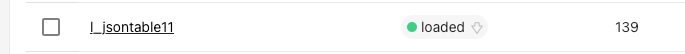
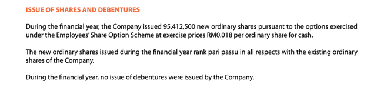

## Assignment 1_2
### Requirements
1. Environment is ready to use, and test files have been downloaded.
You can activate the shared environment using the following command:

```bash
conda activate assignment
```
<details>
<summary>If you are interested, you can expand here and try installing the environment yourself by following the steps below:</summary>


 Step 1: Install Tesseract-OCR

```bash
  sudo apt-get update -y
  sudo apt-get install tesseract-ocr=4.1.1-2.1 -y
  sudo wget https://github.com/tesseract-ocr/tessdata/raw/main/eng.traineddata
  sudo mv eng.traineddata /usr/share/tesseract-ocr/4.00/tessdata/
```

Step 2: To create an environment for assignment 1.1 and activate it.

```bash
conda create -n assignment1_2 python=3.9
conda activate assignment1_2
pip install -r requirements.txt
```
</details>


2. Before using BgeEmbeddings model, you need to put the  `bge-small-en` folder under 
`assignment_1/assignment_1_2/` as shown below.

```
dsta-assignment   
├── assignment_1   
│   ├── assignment_1_1    
│   └── assignment_1_2   
│       ├── bge-small-en   
│       ├── data   
│       ├── ....   
│       └── requirement.txt   
└── assignment_2   
```
3. Please specify your environment variables including `MILVUS_HOST`, `MILVUS_PORT`, `MILVUS_OPENAI_KEY`, `ES_URL` and `MILVUS_DATABASE` in `env.py`.

<br>

### Overview
The function `build_document_index` is used to facilitate the indexing of documents from a PDF file into hybrid database 
system that combines Milvus and Elasticsearch.

```Python
# line 12 in build_document_index.py
def build_document_index(pdf_bin, table_name, converter_engine, milvus_openai_embedding_enabled=True,
                         embedding_name='BgeEmbeddings', overwrite=False):
  ```

### Function Parameters 
* **pdf_bin**: Binary data of the PDF file to be indexed.
* **table_name**: Specify a table name for the collection. The name identifies where the documents are stored in the hybrid database. 
* **converter_engine**: Engine for converting PDFs to IDP docs (json files). 
  * To convert ePDFs, set the parameter as `'PYMUPDF'`.
  * To convert scanned PDFs, set the parameter as `'OCR'`.
* **milvus_openai_embedding_enabled**: Boolean flag to enable Milvus embeddings with OpenAI.
* **embedding_name**: Choose from
  * `'BgeEmbeddings'` (refer to Requirements)
  * `'text-embedding-ada-002'`
  * `'text-embedding-3-small'`
  * `'text-embedding-3-large'`
  * `'FakeEmbeddings'` (Need to set `milvus_openai_embedding_enabled=False`)
* **overwrite**: Boolean flag to overwrite an existing index with the same name.

### Usage

**Step 1:** Check that the PDFs are placed under `assignment_1_2/data/`.   
**Step 2:** Rename `ATSAR2023+bursa` under the main function to the document name that you want to build index.   
**Step 3:** Run the main function. 

```Python
if __name__ == "__main__":
    import pathlib
    data_path = pathlib.Path(__file__).parents[0] / 'data'
    pdf_file_path = data_path / 'ATSAR2023+bursa.pdf'
    pdf_bin = pdf_file_path.read_bytes()

    # for local embedding model BgeEmbedding
    table_name = "jsontable_bgeembedding"
    embedding_name = 'BgeEmbeddings'

    converter_engine = 'PYMUPDF'
    build_status = build_document_index(pdf_bin, table_name, converter_engine, embedding_name=embedding_name, overwrite=True)
    print(build_status)
```

### Dataset
Sample PDFs can be accessed from the folder `data`. 

### Additional Note
If you have access to Milvus dashboard, you will notice that the collection name (table name) 
may be slightly different from the `table_name` that you have input in `build_document_index.py`. 
This is because prefixes may be added depending on the embeddings method you choose.

**Example**   
In `build_document_index.py`:
```Python
table_name = "jsontable11"
embedding_name = 'text-embedding-3-large'
```
In Milvus dashboard:



If you are interested, you can refer to line 221 in `milvus_db.py` for the code.
```Python
def get_milvus_collection_name(collection_name, embedding=None, embedding_name=None):
    assert embedding or embedding_name
    if embedding is None:
        embedding = create_embedding(True, embedding_name)
    prefix_map = {'text-embedding-ada-002': '', 'text-embedding-3-small': 's_', 'text-embedding-3-large': 'l_'}
    prefix = prefix_map.get(embedding.model, '') if isinstance(embedding, OpenAIEmbeddings) else ''
    return f'{prefix}{collection_name.lower()}'
```

___

### Question 1 
The `create_document_string` function (line 103 in `assignment_1_1/data_chunk.py`) is used to concatenate and format text content from the document into a single string. 
Currently our approach is to add spaces as paddings to the text if necessary to reflect the original position of the texts in the page as accurately as possible. 

You are required to write another method to simply join all the paragraphs into a single string.   

Note: Remember to change `simple_join=True` before testing your function.
```Python
def create_document_string(page, prefix='### Input:\n\n', connector='\t', simple_join=False):
    # ... some code
    
    # line 127 in assignment_1_1/data_chunk.py
    else:
        # todo: Question 1
        pass
```

<details>
<summary>Hints</summary>
Remember to sort the paragraphs according to their positions before joining.
</details>

### Question 2
Run the main function under `build_document_index.py` for the test file `ATSAR2023+bursa.pdf`. 
You should see the line "Document finished index building" if your function works correctly.

Currently, the function `build_document_index` will save the document into hybrid database. 
You are required to modify the function such that it can also save the document into Milvus database only.

Note: Your new function must have both methods (saving documents in 1. hybrid database and 2. Milvus database only) as we will be using both of them in the next few questions.

### Question 3
Let's experiment with your new function! In this task, you should save the test file `ATSAR2023+bursa.pdf` in Milvus database only.

After inserting the documents into your database, search the database with the following query and top_k. Change `i` to see each of the results extracted.

Note: If you are interested, you can go and read the `search` method in `base_db.py` line 80.
```Python
# you should find this line under your build_document_index function
milvus_db.insert_documents(doc)
results = milvus_db.search(
    query="how many shares has been issued during the financial year", top_k=3
)
print(results[i])
```
The correct answer is located at page 5 of `ATSAR2023+bursa.pdf`  as shown below.


Try searching the database with `'BgeEmbeddings'` and at least one other embedding method as stated above at `Function Parameters` section. Experiment with different `top_k`. 
Which embedding method give you the most accurate result? 

Note: When you change the embedding method or top_k, you should save your table with different `table_name` to prevent the table being overwritten. 

<details>
<summary>Hints</summary>
You get accurate result when the correct page being extracted with a low top_k.
</details>

### Question 4
In this task, you should save the test file `ATSAR2023+bursa.pdf` in the hybrid database.
Similar to the previous question, try  searching the database with `'BgeEmbeddings'` and at least one other embedding method and change your `top_k`. 
Which embedding method give you the most accurate result? 

