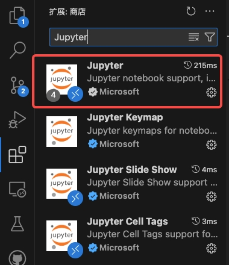
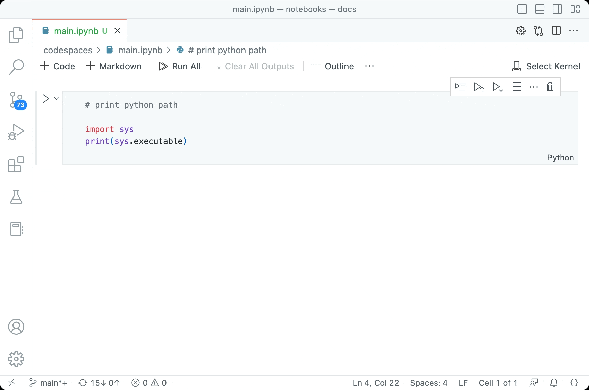
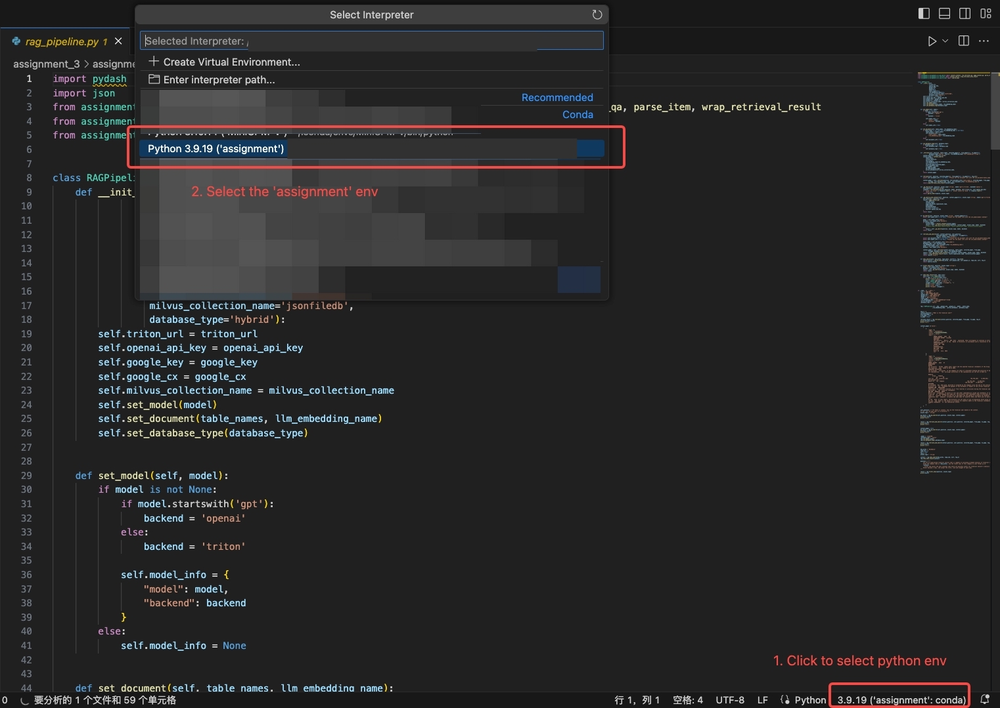

Assignment 3.2
====================

In this section, we will explore the Retrieval-Augmented Generation (RAG) pipeline to optimize the output of Large Language Models (LLM) by utilizing external knowledge base as reference.

## Description

* `rag_pipeline.py`: Interfaces for the RAG pipelines.
* `retrieve.py`: Utility functions for retrieving context from databases.
* `qa_search.py`: Utility functions for calling Large Language Models to answer questions.
* `search_news.py`: Utility functions for searching news from the Internet.
* `assignment_3_2.ipynb`: Demonstration of the RAG pipelines.

## Installation

### Environment Setup
Environment is ready to use.
You can activate the shared environment using the following command:

```bash
conda activate assignment
```

<details>
<summary>
If you are interested, you can expand here and try installing the environment yourself by following the steps below:
</summary>

Step 1: Create an Environment with Python 3.9
```bash
conda create -n assignment3_2 python=3.9 ipykernel
conda activate assignment3_2
```
Step 2: Install dependencies
```bash
pip install -r requirements.txt
```

</details>

### Use Jupyter Notebook in VSCode
This assignment is ready in an IPYNB file, which we recommand you to open with Jupyter Notebook Extension in VSCode. Actually, you can also copy the code in the ipynb file to a local file and run it, but it may be a bit cumbersome.

Follow the steps below to set up your Jupyter Notebook Extension on VSCode.

Step 1: Start VSCode, click `Extensions` in the left sidebar, search for `Jupyter` and install the extension.

<div align=center>
    
</div><br>

Step 2: Open the IPYNB file `assignment_3_2.ipynb` in VSCode and click `Select Kernel` -> `assignment (Python3.9.19)`.

<div align=center>
    
</div><br>

<details>
<summary>If `assignment (Python3.9.19)` doesn't exist in the drop-down list after you click `Select Kernel`, you can try the following steps to extend the kernel options.
</summary>

1. Open any python file in the `assignment_3_2` folder in VSCode -> Click `Interpreter` at the bottom right corner of the window and select `Python 3.9.19 (assignment)`.

2. Open the IPYNB file `assignment_3_2.ipynb` in VSCode -> Click `Select Kernel` -> `Select Another Kernel` -> `Python Environments` -> `assignment (Python3.9.19)`.

<div align=center>
    
</div>
</details>

For more details about configuration and operation of the Jupyter Notebook, please refer to [Manage Jupyter Kernels in VS Code](https://code.visualstudio.com/docs/datascience/jupyter-kernel-management) and [Jupyter Notebooks in VS Code](https://code.visualstudio.com/docs/datascience/jupyter-notebooks)

## RAG pipeline

To proceed in this section, you must have completed Assignment 1.2 and use the `build_document_index` to add a PDF file to the databases. The `table name` and the `llm_embedding_name` from the `build_document_index` is required to retrieve context.  Then, run the RAG pipeline in the `assignment_3_2.ipynb`.

There is a sample answer for each question. You can click on `Example Solution` at the end of each question to view the sample prompt. However, we recommend that you try it yourself before checking the sample prompt.
